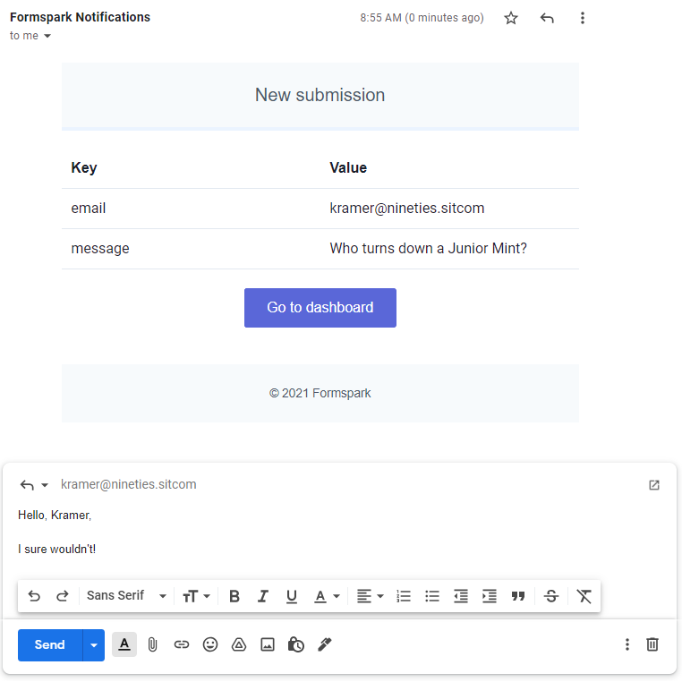

# Direct replies

From your email inbox, you can directly reply to the person who submitted the form.



To activate this feature, create an input with any of the following names:

- `mail`
- `email`
- `_replyto`
- `_email.replyto`

```html
<input type="email" name="mail" placeholder="Your email" />
```

```html
<input type="email" name="email" placeholder="Your email" />
```

```html
<input type="text" name="_replyto" placeholder="Your email" />
```

```html
<input type="text" name="_email.replyto" placeholder="Your email" />
```

::: warning
Input names starting with an underscore will be hidden from the dashboard and notification emails.
:::
