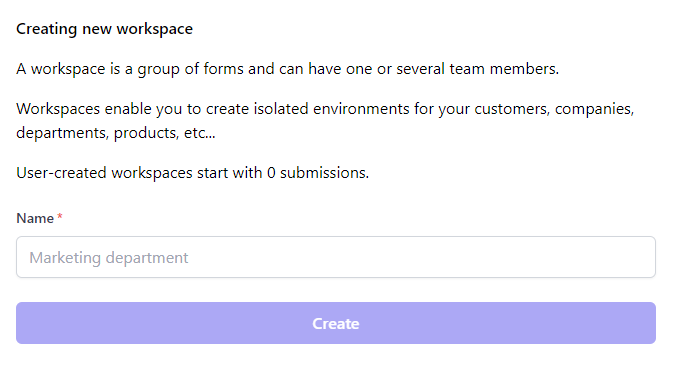

# Additional workspaces

A workspace is a group of forms and can have one or several team members.

Workspaces enable you to create isolated environments for your customers, companies, departments, products, etc...

Additional user-created workspaces start with 0 submissions. All upgrades, bundles, and deals are per workspace.

## Steps

1. Press the `+` button to rhe right of your workspace
2. Fill the form and press `Create`

