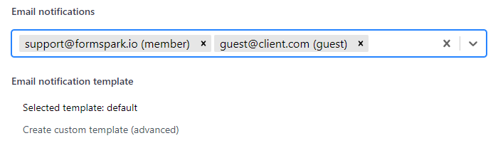

# Email notification settings

To manage your form's email notification settings, navigate to its `Settings` section.

- You can enable/disable email notifications for your workspace's team members.
- You can add guests to send email notifications to people outside your workspace/organization.

## Custom templates

You can customize the notification email template of a form.

Formspark custom email templates use the [Handlebars](https://handlebarsjs.com/) templating language.