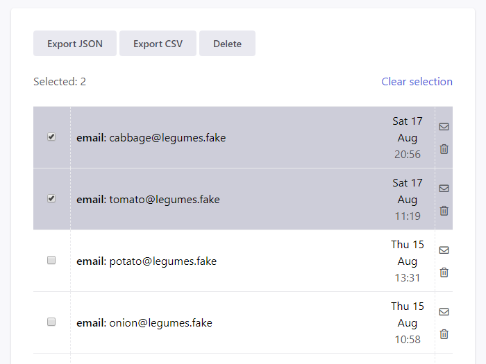

# Exporting submissions

You can easily export your data as JSON or CSV documents.

## Steps

1. Navigate to your form's `Submissions` section

2. Select the submissions you want to export

   

3. Press `Export JSON` or `Export CSV`
