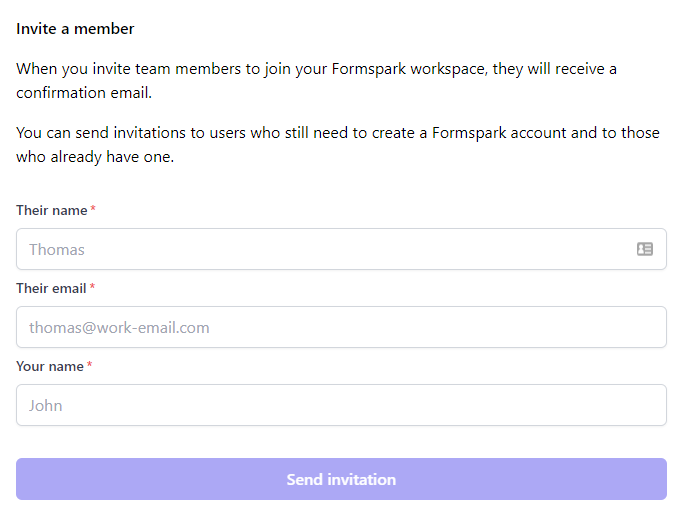

# Inviting team members

You can invite members to your workspace to create forms and view submission as a team.

When you invite team members to join your Formspark workspace, they will receive a confirmation email.

:::tip
You can send invitations to users who still need to create a Formspark account or to those who already have one.
:::

## Steps

1. Open the `Members` screen
2. Fill the form and press `Send`

