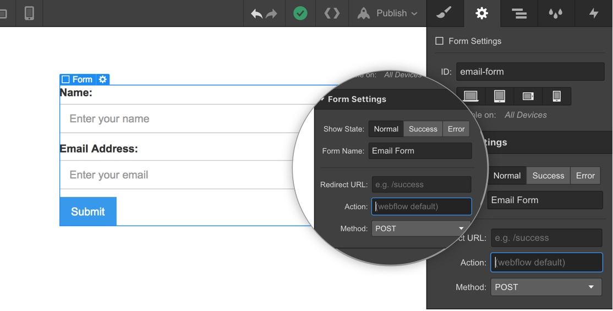

# Webflow

1. Copy your form's action URL.
2. Paste the action URL into Webflow's `action` field in the form element’s settings in the Designer.
3. Copy-paste the code below into `Project Settings > Custom Code > Footer Code`.



```html
<!-- Project Settings > Custom Code > Footer Code -->

<script src="https://unpkg.com/@formspark/formson"></script>

<script type="text/javascript">
  $('form[action^="https://submit-form.com"]').each(function (i, el) {
    var form = $(el);
    form.submit(function (e) {
      e.preventDefault();
      form = $(e.target);
      var action = form.attr("action");
      var data = Formson.toJSON(new FormData(e.target));
      $.ajax({
        url: action,
        method: "POST",
        data: JSON.stringify(data),
        dataType: "json",
        contentType: "application/json",
        success: function () {
          var parent = $(form.parent());
          parent.children("form").css("display", "none");
          parent.children(".w-form-done").css("display", "block");
        },
        error: function () {
          var parent = $(form.parent());
          parent.find(".w-form-fail").css("display", "block");
        },
      });
    });
  });
</script>
```

## Redirect after submission

```html
<!-- Project Settings > Custom Code > Footer Code -->

<script src="https://unpkg.com/@formspark/formson"></script>

<script type="text/javascript">
  $('form[action^="https://submit-form.com"]').each(function (i, el) {
    var form = $(el);
    form.submit(function (e) {
      e.preventDefault();
      form = $(e.target);
      var action = form.attr("action");
      var data = Formson.toJSON(new FormData(e.target));
      $.ajax({
        url: action,
        method: "POST",
        data: JSON.stringify(data),
        dataType: "json",
        contentType: "application/json",
        success: function () {
          window.location.href = "https://your-website.com/thanks"; // Replace with your success URL
        },
        error: function () {
          window.location.href = "https://your-website.com/error"; // Replace with your error URL
        },
      });
    });
  });
</script>
```

## Botpoison spam protection

```html
<!-- Project Settings > Custom Code > Footer Code -->

<script src="https://unpkg.com/@formspark/formson"></script>
<script src="https://unpkg.com/@botpoison/browser" async></script>

<script type="text/javascript">
  $('form[action^="https://submit-form.com"]').each(function (i, el) {
    var form = $(el);
    form.submit(function (e) {
      e.preventDefault();
      form = $(e.target);
      var action = form.attr("action");
      var botpoison = new Botpoison({
        publicKey: "your-public-key",
      });
      botpoison
        .challenge()
        .then(function (result) {
          var data = Formson.toJSON(new FormData(e.target));
          data["_botpoison"] = result.solution;
          $.ajax({
            url: action,
            method: "POST",
            data: JSON.stringify(data),
            dataType: "json",
            contentType: "application/json",
            success: function () {
              var parent = $(form.parent());
              parent.children("form").css("display", "none");
              parent.children(".w-form-done").css("display", "block");
            },
            error: function () {
              var parent = $(form.parent());
              parent.find(".w-form-fail").css("display", "block");
            },
          });
        })
        .catch(function () {
          var parent = $(form.parent());
          parent.find(".w-form-fail").css("display", "block");
        });
    });
  });
</script>
```

## Tips and tricks

:::tip

- [How to submit Webflow forms to your own backend](https://technotrampoline.com/articles/how-to-submit-webflow-forms-to-your-own-backend/)
- [How to disable the submit button while a form is submitting in Webflow](https://technotrampoline.com/articles/how-to-disable-the-submit-button-while-a-form-is-submitting-in-webflow/)
- [How to pre-fill Webflow form input fields at page load](https://technotrampoline.com/articles/how-to-pre-fill-webflow-form-input-fields-at-page-load/)
- [How to clear all fields of a Webflow form](https://technotrampoline.com/articles/how-to-clear-all-fields-of-a-webflow-form/)
- [How to automatically disable a Webflow button or input](https://technotrampoline.com/articles/how-to-automatically-disable-a-webflow-button-or-input/)
  :::
