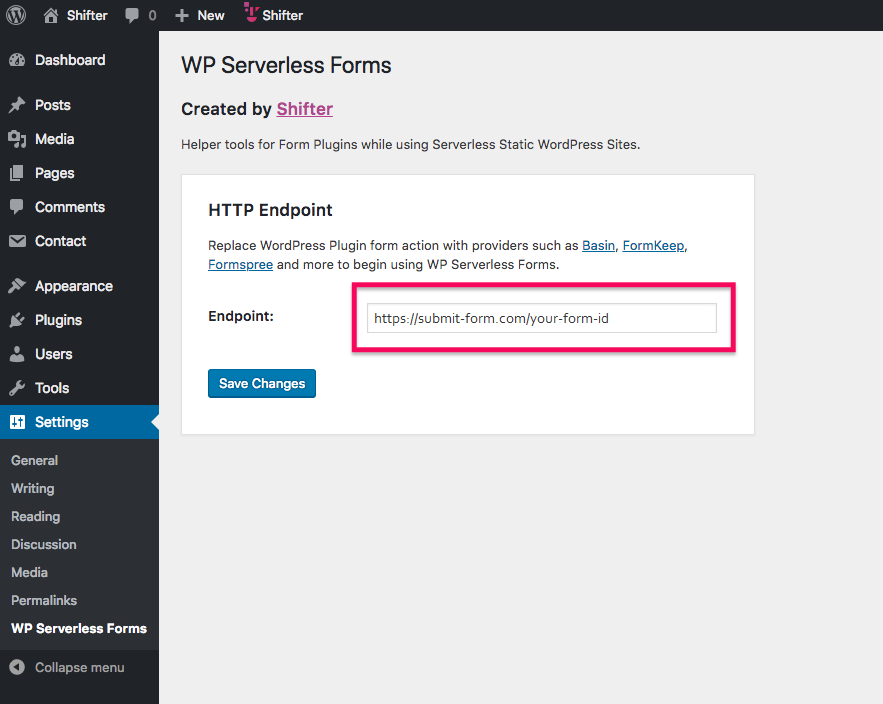

# Wordpress

Wordpress integration is possible via [WP Serverless Forms](https://wordpress.org/plugins/wp-serverless-forms/#description).

1. Download, install and activate [WP Serverless Forms](https://wordpress.org/plugins/wp-serverless-forms/#description).
2. Copy your form's action URL.
3. Paste the action URL into the `HTTP Endpoint` field on your Settings page.

