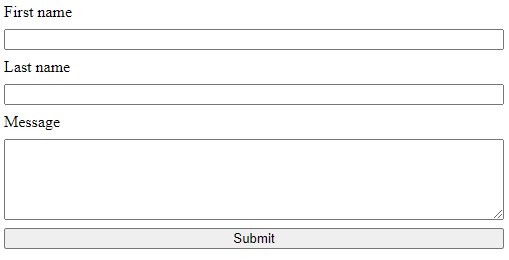

# Form styling

With Formspark you get to bring your own HTML and CSS.

On this page you'll find tips, tricks and links to help you style your forms.

## Simple vertical layout



```html
<!DOCTYPE html>
<html lang="en">
  <head>
    <style>
      .vertical-form {
        display: flex;
        flex-direction: column;
        gap: 0.5rem;
        max-width: 500px;
      }
    </style>
  </head>
  <body>
    <form class="vertical-form" action="https://submit-form.com/your-form-id">
      <label for="first-name">First name</label>
      <input id="first-name" name="first-name" type="text" />
      <label for="last-name">Last name</label>
      <input id="last-name" name="last-name" type="text" />
      <label for="message">Message</label>
      <textarea id="message" name="message" cols="15" rows="5"></textarea>
      <button type="submit">Submit</button>
    </form>
  </body>
</html>
```

## CSS frameworks

- [Bootstrap](https://getbootstrap.com/)
- [Milligram](https://milligram.io/)
- [Tailwind CSS](https://tailwindcss.com/)
