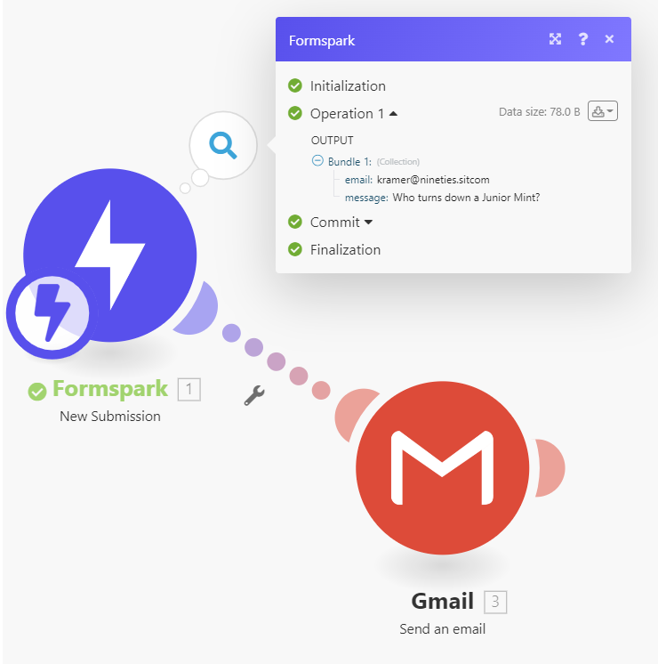

# Integromat

Connecting Formspark and Integromat takes only seconds.

1. Add the Formspark integration to your Integromat account via [this link](https://www.integromat.com/en/apps/invite/139bc1347afadf0e97b8c53c18abd3fd).
2. Open Integromat.
3. Inside the scenario editor, create a new module and select `Formspark`.
4. Select the `New Submission` trigger.
5. Select or create a webhook.
6. Copy the webhook URL (example: https://hook.integromat.com/0123456789)
7. Open Formspark
8. Paste the webhook URL into the `Webhook URL` field found in your form's settings.
9. Send a test submission to your form.

[Check this page](/integration/webhooks) to learn more about webhooks.

