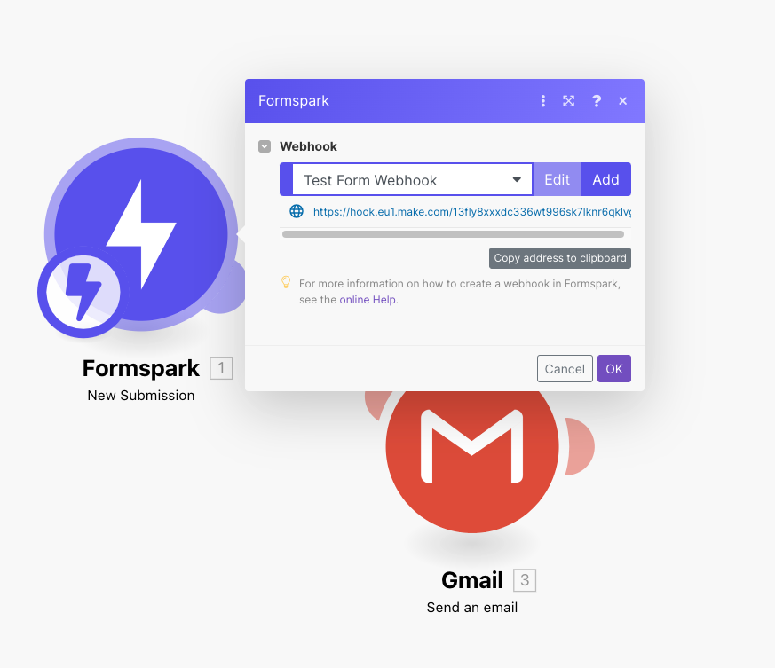

# Make

Connecting Formspark and Make takes only seconds.

1. Add the Formspark integration to your Make account
   via [this link](https://www.make.com/en/hq/app-invitation/e24b1114d4ac44bb0dbdb918a85b286a).
2. Open Make.
3. Inside the scenario editor, create a new module and select `Formspark`.
4. Select the `New Submission` trigger.
5. Select or create a webhook.
6. Copy the webhook URL (example: https://hook.region.make.com/0123456789)
7. Open Formspark
8. Paste the webhook URL into the `Webhook URL` field found in your form's settings.
9. Send a test submission to your form.

[Check this page](/integration/webhooks) to learn more about webhooks.

