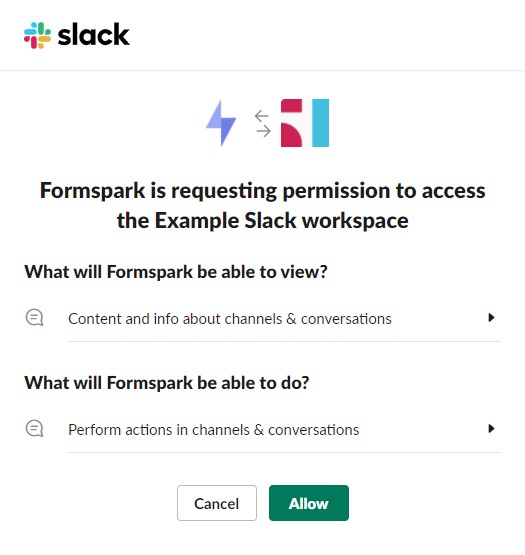
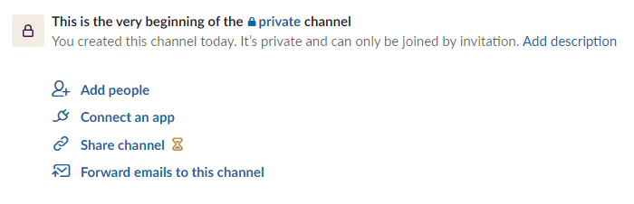

# Slack

Connecting Formspark and Slack takes only seconds and is the easiest way to post form submissions from a website to Slack.

1. Click the `Connect with Slack` link found in your form's settings.

   

2. Allow Formspark to access your slack workspace.

   

3. Update the `Slack channel` field found in your form's settings.

   

4. Save your changes.

## Private channels

Connecting Formspark to a private channel requires 2 extra steps.

1. Click the `Connect an app` link found in your private channel.

   

2. Search for `Formspark` and press add.

   
