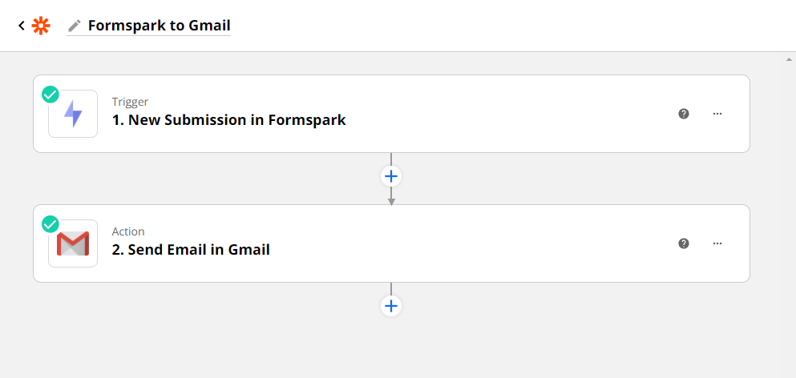

# Zapier

Connecting Formspark and Zapier takes only seconds.

1. Copy your `Zapier key` found in your form's settings.
2. Create a Formspark connection in Zapier via [this link](https://zapier.com/apps/formspark/integrations).
3. Paste your copied key when prompted.

