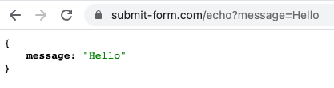

# Installation

```html
<form action="https://submit-form.com/your-form-id">
  <input type="email" name="email" />
  <button type="submit">Subscribe</button>
</form>
```

**1.** Set your HTML form's `action` attribute to your form's action URL.

Your form's unique action URL looks something like this: `https://submit-form.com/your-form-id`.

**2.** Ensure all input, select and textarea elements inside your form have a `name` attribute, otherwise you will not receive the data filled in these fields.

Input names starting with an underscore are reserved and will be hidden from the dashboard and notification emails.

**3.** Verify that your form contains a button element with the "submit" `type`.

### Testing

You can rapidly test your form payloads by submitting to https://submit-form.com/echo.

```html
<form action="https://submit-form.com/echo">
  <input type="text" name="message" />
  <button type="submit">Send</button>
</form>
```



## JavaScript

Formspark has excellent AJAX support, [learn more about it here](/examples/ajax).
