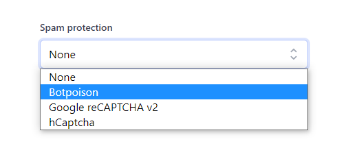

# Spam protection

Every form falls victim to spam bots at some point, how you handle them can affect your customers.

Formspark offers the following solutions to prevent spam:

- [Botpoison](https://botpoison.com/) integration
- [reCAPTCHA](https://www.google.com/recaptcha/about/) integration
- [hCaptcha](https://www.hcaptcha.com/) integration
- [Akismet](https://akismet.com/) integration
- Honeypot technique



Formspark will not save submissions, send notifications or decrement your submission counter if any of the following
conditions are true:

- The submission is empty
- The Botpoison check was unsuccessful
- The captcha verification was unsuccessful
- The submission contains a honeypot

## Botpoison

Formspark integrates with Botpoison, an invisible, user-friendly anti-spam solution.

### Getting started

1. Go to [https://botpoison.com/start/](https://botpoison.com/start/).
2. Create a new configuration.
3. Integrate the `public key` on your website ([instructions](https://botpoison.com/documentation/getting-started/html/)).
4. In your form's settings, select `Botpoison` under `Spam Protection`.
5. Copy the `secret key`, paste it into the `Botpoison secret key` field.

Your form is now protected by Botpoison ✔.

To stop using Botpoison, change your `Spam Protection` to `None`.

### Example

```html
<!DOCTYPE html>
<html lang="en">
  <head>
    <script src="https://unpkg.com/@botpoison/browser"></script>
  </head>
  <body>
    <form
      method="POST"
      action="https://submit-form.com/your-form-id"
      data-botpoison-public-key="your-botpoison-public-key"
      target="_blank"
    >
      <textarea name="message" placeholder="Message"></textarea>
      <button type="submit">Send</button>
    </form>
  </body>
</html>
```

### Recommended libraries

- JavaScript: [@botpoison/browser](https://www.npmjs.com/package/@botpoison/browser)

## reCAPTCHA

Formspark integrates with Google's reCAPTCHA v2 "I'm not a robot" checkbox.

### Getting started

1. Go to [https://www.google.com/recaptcha/](https://www.google.com/recaptcha/).
2. Navigate to the admin console.
3. Create a new site.
4. Make sure you select `reCAPTCHA v2`.
5. Make sure your whitelist your website's domain.
6. Integrate the `site key` on your website ([instructions](https://developers.google.com/recaptcha/docs/display)).
7. In your form's settings, select `Google reCAPTCHA v2` under `Spam Protection`.
8. Copy the `secret key`, paste it into the `reCAPTCHA v2 secret key` field.

Your form is now protected by reCAPTCHA ✔.

To stop using reCAPTCHA, change your `Captcha provider` to `None`.

### Recommended libraries

- React: [react-google-recaptcha](https://github.com/dozoisch/react-google-recaptcha)

### Articles

- [How to enable your submit button based on reCAPTCHA results](https://technotrampoline.com/articles/how-to-enable-your-submit-button-based-on-recaptcha-results/)

## hCaptcha

Formspark integrates with hCaptcha, an independent alternative to Google's reCAPTCHA.

### Getting started

1. Go to [https://www.hcaptcha.com/](https://www.hcaptcha.com/).
1. Integrate the `site key` on your website.
1. In your form's settings, select `hCaptcha` under `Spam Protection`.
1. Copy the `secret key`, paste it into the `hCaptcha secret key` field.

Your form is now protected by hCaptcha ✔.

To stop using hCaptcha, change your `Spam Protection` to `None`.

### Recommended libraries

- React: [react-hcaptcha](https://github.com/hCaptcha/react-hcaptcha)

## Akismet

Formspark integrates with Akismet, a spam filtering service.

This integration requires no additional setup, it is pre-activated for all accounts.

## Honeypot

::: warning
While simple to implement, this technique is not the most effective.
:::

The honeypot technique is a simple-to-implement spam prevention solution.

To enable this feature, add a field with the name `_honeypot` or `_gotcha` to your form and hide it with CSS (see
example below). The submission will be silently ignored when a spam bot enters a value.

```html
<form action="https://submit-form.com/your-form-id">
  <input
    type="checkbox"
    name="_honeypot"
    style="display:none"
    tabindex="-1"
    autocomplete="off"
  />
  <input type="email" name="email" />
  <button type="submit">Subscribe</button>
</form>
```

## Custom honeypot

Instead of using `_honeypot` or `_gotcha`, you can specify your own honeypot name in your form's settings.

```html
<form action="https://submit-form.com/your-form-id">
  <input
    type="checkbox"
    name="Paste your custom honeypot here"
    style="display:none"
    tabindex="-1"
    autocomplete="off"
  />
  <input type="email" name="email" />
  <button type="submit">Subscribe</button>
</form>
```
