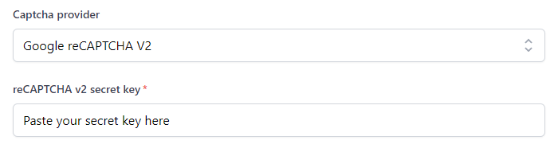
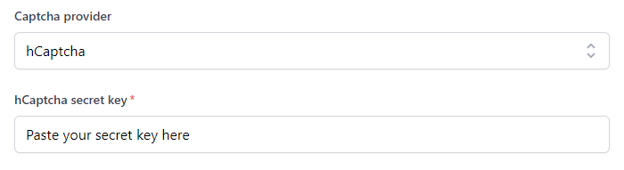

# Spam protection

Every form falls victim to spam bots at some point. How you handle them can affect your customers.

Formspark implements the following opt-in solutions to fight spam:

- Captcha integrations:
  - Google's reCAPTCHA V2
  - hCaptcha
- Honeypot technique

Formspark will not save submissions, send notifications or decrement your submission counter if any of the following conditions is true:

- The submission is empty
- The submission contains a honeypot
- The captcha verification was unsuccessful

## reCAPTCHA

Formspark integrates with Google's reCAPTCHA V2 "I'm not a robot" checkbox.

1. Open [https://www.google.com/recaptcha/](https://www.google.com/recaptcha/)
2. Navigate to the admin console.
3. Create a new site.
4. Make sure you select `reCAPTCHA V2`.
5. Make sure your whitelist your website's domain.
6. Integrate the `site key` on your client ([instructions](https://developers.google.com/recaptcha/docs/display)).
7. Select `Google reCAPTCHA V2` as your `Captcha provider` in your form's settings.
8. Copy the `secret key`, paste it into the `reCAPTCHA V2 secret key` field.

Formspark will now use your secret key to verify the reCAPTCHA response.



To stop using reCAPTCHA, change your `Captcha provider` to `None`.

## hCaptcha

Formspark integrates with hCaptcha, an independent alternative to Google's reCAPTCHA.

1. Integrate the `site key` on your client.
2. Select `hCaptcha` as your `Captcha provider` in your form's settings.
3. Copy the `secret key`, paste it into the `hCaptcha secret key` field.

Formspark will now use your secret key to verify the hCaptcha response.



To stop using hCaptcha, change your `Captcha provider` to `None`.

## Honeypot

The honeypot technique allows us to ignore spam bots without forcing your users to fill out a captcha or jump through other hoops.

To enable this feature, add a field with the name `_honeypot` or `_gotcha` to your form and hide it with CSS (see example below). The submission will be silently ignored when a spam bot enters a value.

```html
<form action="https://submit-form.com/your-form-id">
  <input
    type="checkbox"
    name="_honeypot"
    style="display:none"
    tabindex="-1"
    autocomplete="off"
  />
  <input type="email" name="email" />
  <button type="submit">Subscribe</button>
</form>
```

## Custom honeypot

Instead of using `_honeypot` or `_gotcha`, you can specify your own honeypot name in your form's settings.

```html
<form action="https://submit-form.com/your-form-id">
  <input
    type="checkbox"
    name="Paste your custom honeypot here"
    style="display:none"
    tabindex="-1"
    autocomplete="off"
  />
  <input type="email" name="email" />
  <button type="submit">Subscribe</button>
</form>
```
