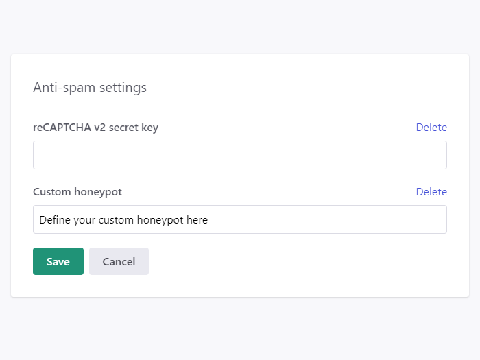

# Spam protection

Every form falls victim to spam bots at some point. How you handle them can affect your customers, Formspark integrates with Google's reCAPTCHA v2 and also implements the honeypot technique.

Formspark will not save submissions, send notifications or decrement your submission counter if any of the following conditions is true:

- The submission is empty
- The submission contains a honeypot
- The reCAPTCHA verification was unsuccessful

## reCAPTCHA

Formspark integrates with Google's reCAPTCHA v2 "I'm not a robot" checkbox.

1. Open [https://www.google.com/recaptcha/](https://www.google.com/recaptcha/)
2. Navigate to the admin console.
3. Create a new site.
4. Make sure you select reCAPTCHA v2.
5. Make sure you whitelist your website's domain.
6. Integrate the `site key` on your client ([instructions](https://developers.google.com/recaptcha/docs/display)).
7. Copy the `secret key`, paste it into the `reCAPTCHA v2 secret key` field found in your form's settings.

Formspark will now use your secret key to verify the reCAPTCHA response.


To stop using reCAPTCHA, clear the `reCAPTCHA v2 secret key` field found in your form's settings.

## Honeypot

The honeypot technique allows us to ignore spam bots without forcing your users to fill out a captcha or jump through other hoops.

To enable this feature, add a field with the name `_honeypot` or `_gotcha` to your form and hide it with CSS (see example below). The submission will be silently ignored when a spam bot enters a value.

```html
<form action="https://submit-form.com/your-form-id">
  <input
    type="checkbox"
    name="_honeypot"
    style="display:none"
    tabindex="-1"
    autocomplete="off"
  />
  <input type="email" name="email" />
  <button type="submit">Subscribe</button>
</form>
```

## Custom honeypot

Instead of using `_honeypot` or `_gotcha`, you can specify your own honeypot name in your form's settings.



```html
<form action="https://submit-form.com/your-form-id">
  <input
    type="checkbox"
    name="Paste your custom honeypot here"
    style="display:none"
    tabindex="-1"
    autocomplete="off"
  />
  <input type="email" name="email" />
  <button type="submit">Subscribe</button>
</form>
```
